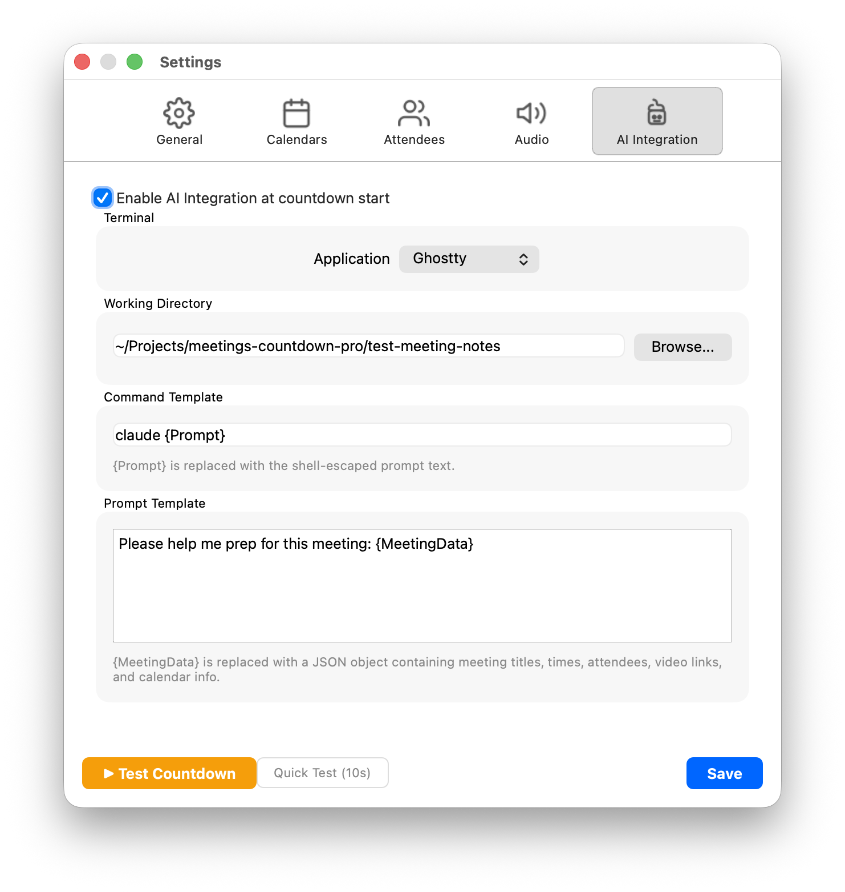
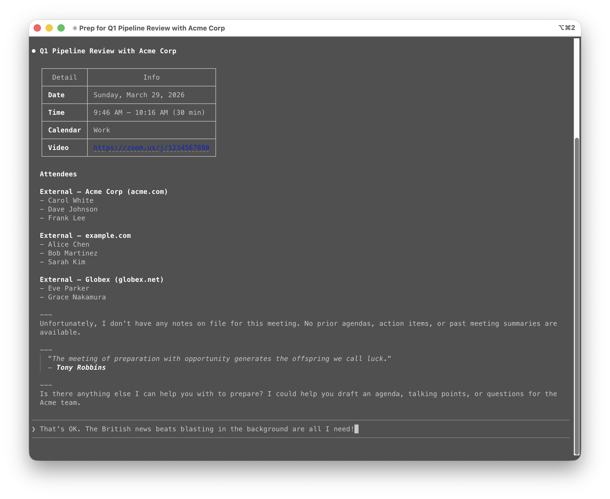

# AI Integration

## The Future of Meetings Is Here, and It Has a Terminal Window

Meetings Countdown Pro is not just a countdown app. It is a **meeting intelligence platform**. A **pre-call preparation engine**. A **context-aware, AI-orchestrated, just-in-time meeting readiness system** that leverages the full power of large language models to ensure that when the countdown hits zero and the clapperboard snaps, you are not just on time — you are *prepared*.

Or, you know, it runs a terminal command. But let's not lead with that.



## What It Actually Does

When a countdown starts and AI Integration is enabled, the app:

1. Gathers meeting context (title, attendees, time, organizations, video link, calendar) into a JSON structure.
2. Substitutes that data into your configured prompt template.
3. Launches your configured command in a new terminal window with the assembled prompt.

The terminal session is fully interactive and persists after the countdown ends. The app launches it and gets out of the way.

**The practical use case:** Many of us now use AI coding agents to organize meeting notes, prep materials, and context in markdown files. This feature lets the agent pull up relevant history, previous notes, and action items *automatically* as the countdown runs. By the time the music stops, both you and your AI assistant are briefed and ready.

## Enabling AI Integration

Two ways to toggle it:

- **Settings → AI Integration tab** → check "Enable AI Integration at countdown start"
- **Menu bar dropdown** → check "Enable AI Integration"

Both are synced — changing one updates the other.

## Configuration

### Terminal Application

Which terminal app to open for the agent session:

| Option | Notes |
|---|---|
| **Terminal.app** | Built-in macOS terminal. Always available. |
| **[iTerm2](https://iterm2.com/)** | Popular third-party terminal. Must be installed separately. |
| **[Ghostty](https://ghostty.org/)** | Modern GPU-accelerated terminal. Requires Ghostty 1.3 or later (for AppleScript support). Must be installed separately. |

The app uses AppleScript to create a new window in the selected terminal. The command runs as a login shell (`zsh -l`), so your login profile is loaded. See [Troubleshooting](#iterm2-a-session-ended-very-soon-after-starting) if your agent CLI isn't found — there's a common gotcha with iTerm2 and where PATH is configured.

**Default:** Terminal.app

### Working Directory

The directory the terminal session starts in. Click **Browse...** to select a folder, or type a path directly.

This should be wherever you keep your meeting-related files — for example, a `meeting-notes/` directory that your AI agent knows how to navigate.

**Default:** `~` (home directory)

### Command Template

The shell command to execute. Use `{Prompt}` as a placeholder — the app replaces it with the fully assembled, shell-escaped prompt.

```
claude {Prompt}
```

**Important:** Do **not** wrap `{Prompt}` in quotes. The app handles shell escaping automatically via `shlex.quote()`. Adding your own quotes will double-escape and break things.

**Default:** `claude {Prompt}`

#### Example Command Templates

| Command | What It Does |
|---|---|
| `claude {Prompt}` | Launches [Claude Code](https://claude.com/product/claude-code) with meeting context. |
| `kiro-cli chat {Prompt}` | Launches [Kiro](https://kiro.dev/) with meeting context. |
| `bash -c {Prompt}` | Runs the prompt as a shell command (for custom scripts). |
| `cat <<< {Prompt} && read` | Just prints the meeting data and waits. Useful for debugging your prompt template. |

### Prompt Template

A multi-line text area for the prompt that gets sent to your agent (or script). Use `{MeetingData}` as a placeholder — it's replaced with a JSON object containing all meeting context.

```
Please help me prep for this meeting: {MeetingData}
```

**Default:** `Please help me prep for this meeting: {MeetingData}`

You can write as much or as little prompt text as you want around the `{MeetingData}` variable. A more detailed prompt template might look like:

```
I have a meeting starting now. Here is the meeting data:

{MeetingData}

Please:
1. Check my meeting-notes/ directory for any previous notes with these attendees
2. Summarize the last interaction with this organization
3. Create a new notes file for today's meeting with the attendee list pre-filled
4. List any open action items from previous meetings with these people
```

## The {MeetingData} JSON Structure

The `{MeetingData}` variable is replaced with a JSON object containing everything the app knows about the meeting(s) that triggered the countdown:

```json
{
  "meetings": [
    {
      "title": "Q1 Pipeline Review with Acme Corp",
      "date": "2026-03-28",
      "start_time": "2:00 PM",
      "end_time": "2:30 PM",
      "calendar": "Work",
      "video_link": "https://zoom.us/j/1234567890",
      "attendees": [
        {
          "name": "Alice Chen",
          "email": "alice@yourcompany.com",
          "type": "internal"
        },
        {
          "name": "Carol White",
          "email": "carol@acme.com",
          "type": "external",
          "org": "acme.com"
        }
      ]
    }
  ]
}
```

### Field Reference

| Field | Description |
|---|---|
| `title` | Meeting subject line from the calendar event. |
| `date` | Meeting date (YYYY-MM-DD). |
| `start_time` | Start time in the user's local timezone. |
| `end_time` | End time in the user's local timezone. |
| `calendar` | Name of the calendar the event belongs to. |
| `video_link` | Detected video call URL (Zoom, Teams, or Google Meet), or `null` if none found. |
| `attendees` | Array of attendee objects. |
| `attendees[].name` | Display name from the calendar. If only a bare email is available, this is the email address. |
| `attendees[].email` | Email address. |
| `attendees[].type` | `"internal"` or `"external"` based on your Internal Email Domain setting. If no domain is configured, all attendees have `"type": "attendee"`. |
| `attendees[].org` | Email domain (e.g., `"acme.com"`). Only present for external attendees. |

### Simultaneous Meetings

When multiple meetings start at the same time, the `meetings` array contains all of them. Only one terminal session is launched — your agent receives the full context for every simultaneous meeting in a single prompt.

## How It Fits Into the Countdown

Here's the timeline of what happens when a countdown triggers with AI Integration enabled:

```
T-60s   Countdown window slides in, audio starts playing
        ↳ AI Integration fires: terminal window opens, agent receives meeting context
        ↳ Agent starts working: pulling up notes, previous context, prep materials

T-30s   You glance at the attendee panel — ah, external stakeholders from Acme Corp
        ↳ Agent has already found your last meeting notes with Acme

T-10s   Countdown is almost done, agent has prepped your meeting file
        ↳ You scan the agent's output: "Found 3 previous meetings, 2 open action items"

T-0     ACTION! 🎬 → LIVE 🔴
        ↳ You click Join Now, fully briefed, looking like you've been preparing all morning
        ↳ You have not been preparing all morning

T+1s    "Good morning everyone, let me pull up where we left off..."
        ↳ You are now a meetings superhero
```

Here's what that looks like in practice — Claude Code receiving the meeting context and prepping you while the countdown runs:



## But Wait, It Doesn't Have to Be AI

Despite the name (Marketing made us do it), the AI Integration feature is really just **"run a terminal command with meeting data."** The `{MeetingData}` JSON is injected into whatever command you configure. That command doesn't have to involve AI at all.

Some decidedly non-AI things you could do:

- **Open a folder:** `open ~/Documents/meetings/{MeetingData}` (okay, the JSON would make a weird folder name, but you get the idea)
- **Log meetings to a file:** `echo {Prompt} >> ~/meeting-log.txt`
- **Send a webhook:** `curl -X POST -d {Prompt} https://your-webhook-url`
- **Play a second, even more dramatic soundtrack:** `afplay ~/Sounds/dramatic-sting.mp3`
- **Literally anything that runs in a terminal**

We're still calling it AI Integration. The Marketing department was very clear about this.

## Security Notes

The app takes care to prevent shell injection when assembling the command:

1. JSON string values are escaped via `json.dumps(ensure_ascii=True)` — quotes and special characters are handled, and unicode/emoji are escaped to `\uXXXX` sequences.
2. The entire rendered prompt is wrapped with `shlex.quote()` for safe shell passing.

The assembled command is written to a temporary launch script (`~/.config/meetings-countdown-pro/agent-launch.sh`) and executed via the selected terminal application.

## Testing Your Setup

The **Test Countdown** button in Settings also triggers AI Integration (if enabled) using mock meeting data. This is the easiest way to verify your command template, prompt template, and working directory are all configured correctly without waiting for a real meeting.

See [Test Mode](test-mode.md) for details.

## Troubleshooting

| Problem | Solution |
|---|---|
| Terminal window doesn't open | Check that the selected terminal app (Terminal.app, iTerm2, or Ghostty) is installed and can be controlled via AppleScript. For iTerm2, you may need to allow automation in **System Settings → Privacy & Security → Automation**. |
| iTerm2: "A session ended very soon after starting" | See [iTerm2 PATH issue](#iterm2-a-session-ended-very-soon-after-starting) below. |
| `command not found` in terminal | Your agent CLI tool (e.g., `claude`) isn't in your PATH for non-interactive shells. See [iTerm2 PATH issue](#iterm2-a-session-ended-very-soon-after-starting) below. |
| Prompt looks wrong or is truncated | Make sure you're not wrapping `{Prompt}` in quotes in your command template. The app handles escaping automatically. |
| Agent gets garbled meeting data | Check your prompt template — `{MeetingData}` should appear exactly once, spelled exactly as shown (case-sensitive, with curly braces). |
| Nothing happens when countdown starts | Verify AI Integration is enabled — check both the Settings tab and the menu bar toggle. |

### iTerm2: "A session ended very soon after starting"

If you see this iTerm2 error:

> *A session ended very soon after starting. Check that the command in profile "Default" is correct.*

The underlying cause is `command not found` — your agent CLI (e.g., `claude`) isn't in the PATH. iTerm2 doesn't show you the shell error, which makes this hard to diagnose.

**Why this happens:** The app launches the agent via `zsh -l /path/to/script.sh`. This is a login shell, but because it's running a script file it is **not interactive**. Zsh only reads `~/.zshrc` for interactive shells. If your PATH additions (like `export PATH=$HOME/.local/bin:$PATH`) are in `~/.zshrc`, they won't be applied, and tools like `claude` won't be found.

Terminal.app isn't affected because its AppleScript integration (`do script`) runs commands inside an interactive shell session that has already sourced `~/.zshrc`. iTerm2's `create window with default profile command` runs the command directly with no interactive shell wrapper.

**The fix:** Add your PATH additions to **`~/.zshenv`** or **`~/.zprofile`** — these are sourced for all login shells regardless of whether they are interactive. For example, if `claude` is installed at `~/.local/bin/claude`, add this line:

```bash
export PATH=$HOME/.local/bin:$PATH
```

To verify the fix works, run this from any terminal:

```bash
env -i HOME=$HOME zsh -l -c 'which claude'
```

If that prints the path to `claude`, you're all set. If it prints `claude not found`, your PATH addition isn't in the right file yet.

For a deep dive into which zsh startup files are sourced under which conditions, see the [Zsh Startup Files documentation](https://zsh.sourceforge.io/Intro/intro_3.html).
