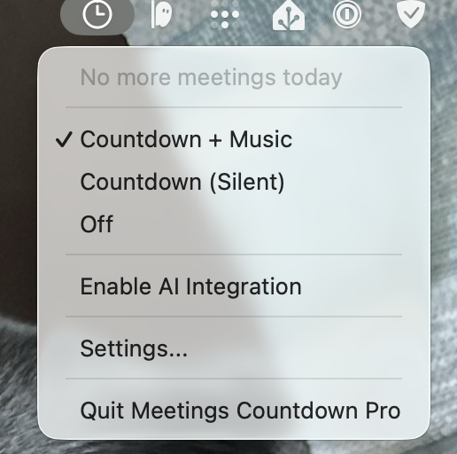

# Menu Bar

Meetings Countdown Pro lives in your macOS menu bar. The icon has two visual states:

- **Active:** Full-color icon — the app is monitoring your calendar.
- **Disabled:** Greyed-out icon — countdowns are turned off (mode set to Off).

## Dropdown Menu

Click the menu bar icon to open the dropdown:

### Next Meeting

The top line shows your next upcoming meeting with its time and title. If there's nothing left on your calendar today, it shows **"No more meetings today"**.

### Mode

Three mutually exclusive modes control how countdowns behave:

| Mode | What Happens |
|---|---|
| **Countdown + Music** | Full experience — countdown window with synchronized audio. This is the default. |
| **Countdown (Silent)** | Visual countdown only, no audio. Good for when you're already on a call or in a quiet space. |
| **Off** | No countdowns at all. The app stays in the menu bar so you can quickly re-enable it. |

The mode switch takes effect immediately. If you switch to Off mid-countdown, the current countdown is not interrupted — it just prevents future ones.

### Enable AI Integration

A checkbox toggle that enables or disables the [AI Integration](ai-integration.md) feature. This is synced with the toggle in the AI Integration settings tab — changing it in either place updates both.

### Settings

Opens the [Settings window](settings-general.md).

### Quit

Exits the application. Any active countdown window is closed.
