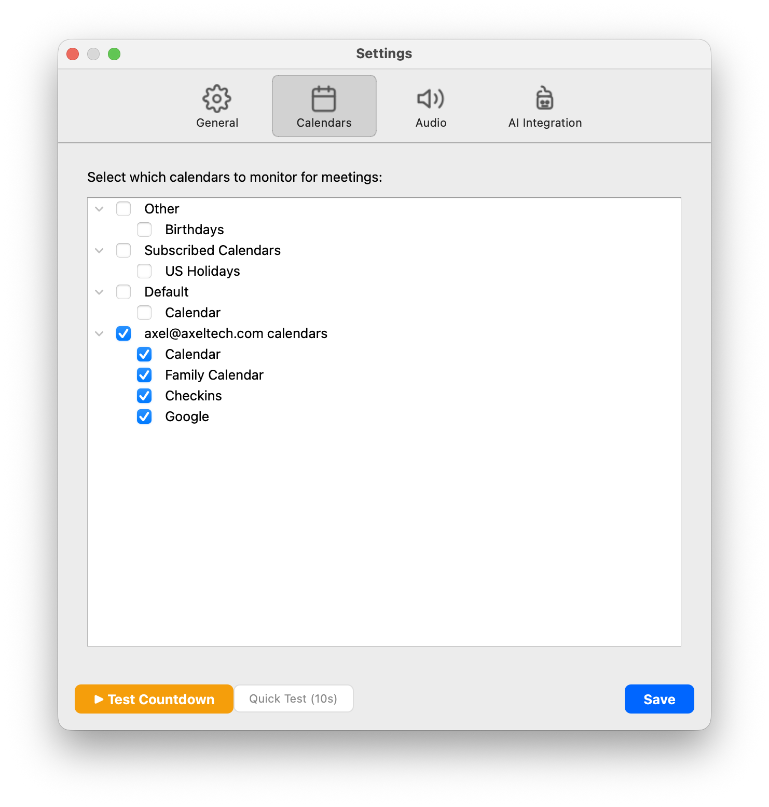
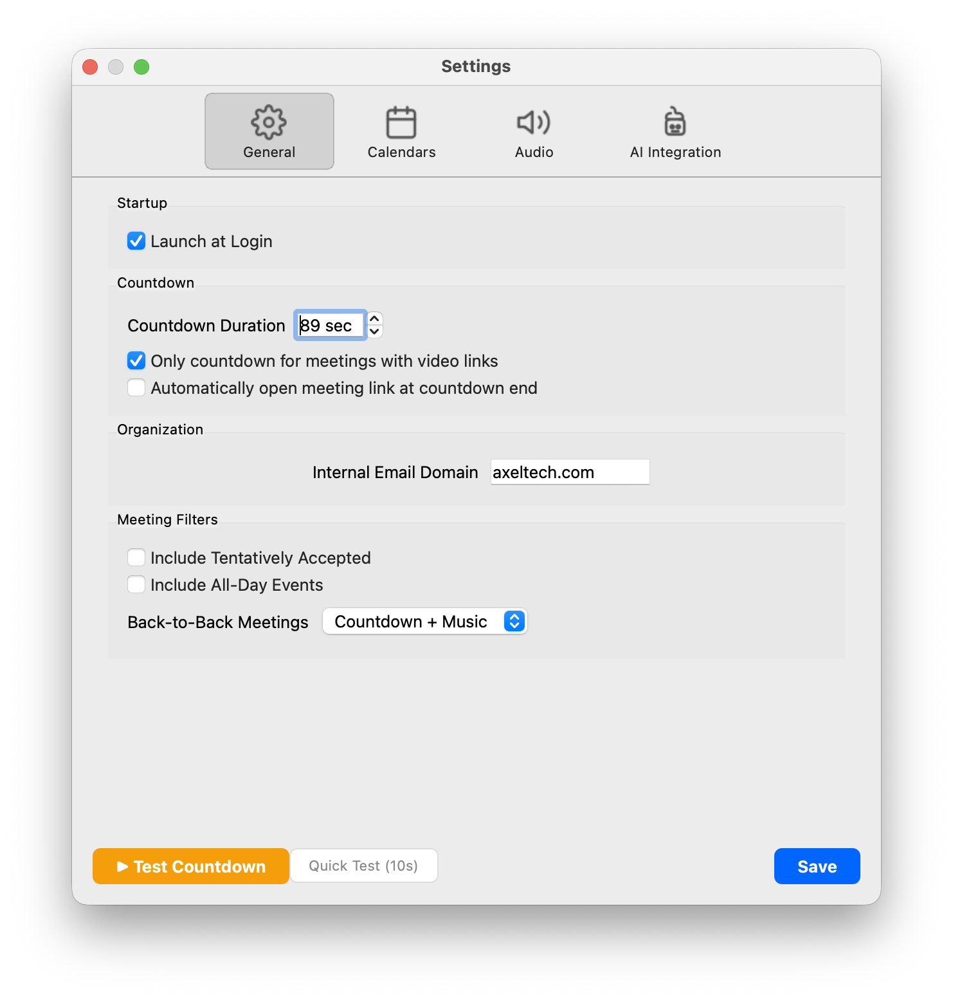
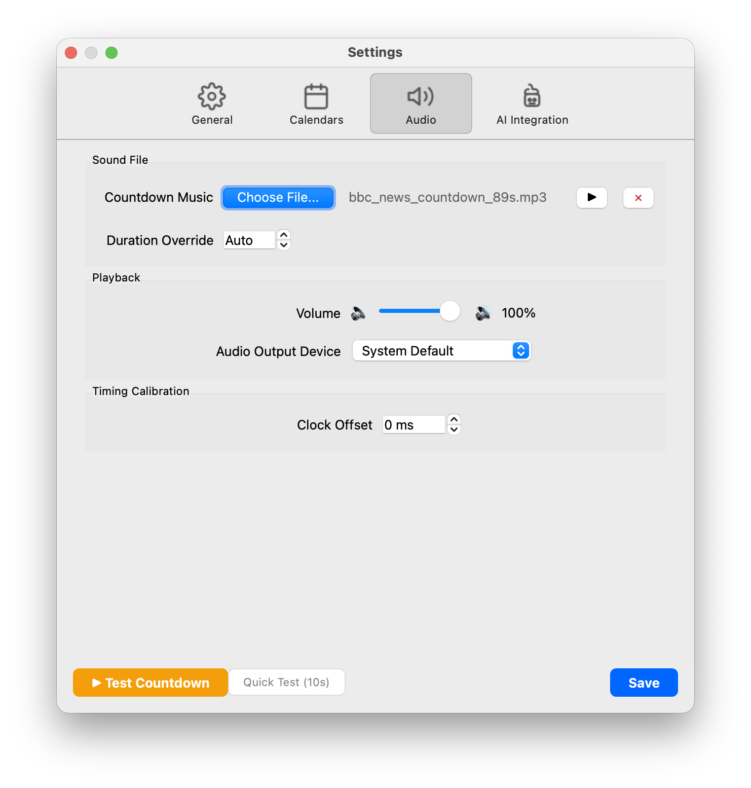
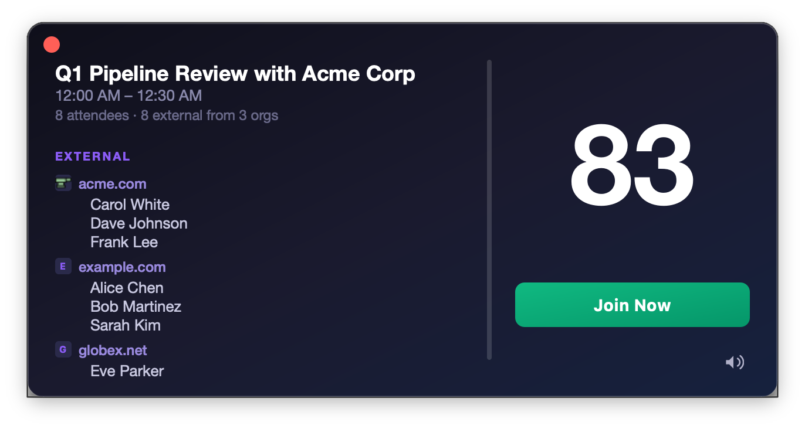
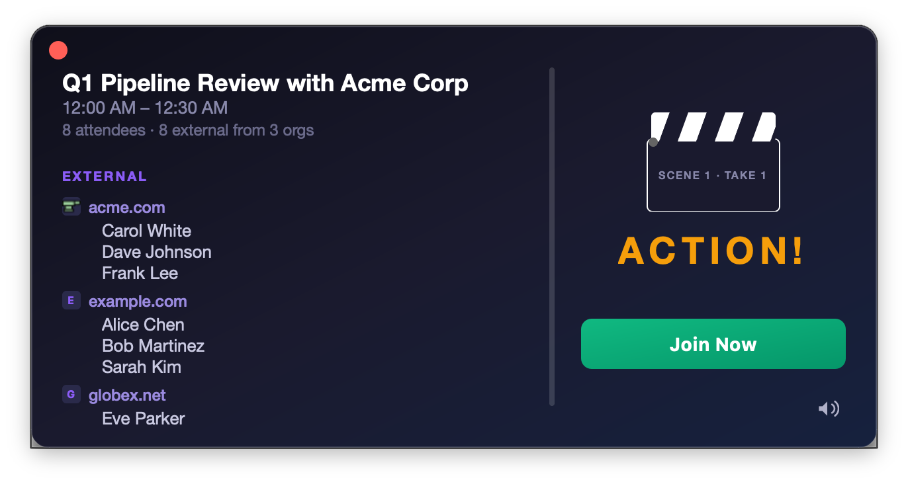
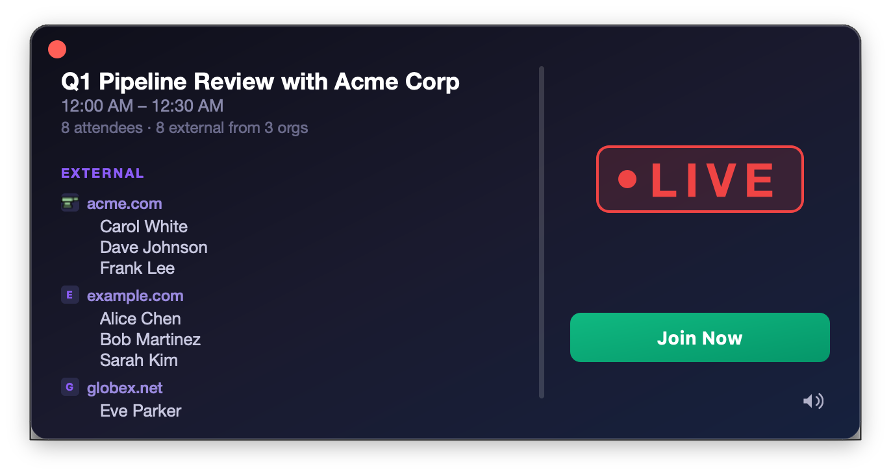

# Quick Start

Get Meetings Countdown Pro configured and running your first countdown in about 5 minutes.

## 1. Launch the App

After [installing the app](../README.md#installation), launch it from your Applications folder. You'll see a small clock icon appear in your menu bar — that's Meetings Countdown Pro, quietly standing by.

On first launch, macOS will ask you to grant calendar access. Click **Allow** — the app needs this to read your meeting schedule. If you accidentally deny it, you can fix this in **System Settings → Privacy & Security → Calendars**.

## 2. Open Settings

Click the menu bar icon and select **Settings...** to open the preferences window.

## 3. Select Your Calendars

Go to the **Calendars** tab. You'll see all of your macOS Calendar accounts listed in a tree view with their individual calendars nested below.

Check the calendars you want monitored. Most people will want their work calendar enabled and personal calendars disabled — unless you want a dramatic countdown before your dentist appointment (no judgment).

## 4. Set Your Internal Email Domain

Back on the **General** tab, find the **Internal Email Domain** field under Organization.

Enter your company's email domain (e.g., `acme.com`). This is how the app knows who's internal to your organization and who's external. The countdown window groups attendees by internal vs. external, so you can see at a glance whether you need to be on your best behavior.

If you leave this blank, all attendees are shown in a single flat list.

## 5. Choose Your Audio

Switch to the **Audio** tab and click **Choose File...** to select your countdown music.

The app accepts MP3, WAV, FLAC, and AAC files. The audio will automatically synchronize so that it **ends exactly when the countdown hits zero** — no matter how long your audio file is relative to your countdown duration.

Popular choices:
- The BBC News Countdown (the classic — 89 seconds of pure gravitas)
- A dramatic orchestral piece
- The Jeopardy! think music (for those who like to live dangerously)

Use the **Preview** button (▶) next to the file name to hear a 10-second sample.

## 6. Save and Wait

Click **Save**. The app is now monitoring your calendar. When a meeting with a video link is approaching, the countdown window will slide in from the right side of your screen.

Or, if you're impatient (understandable), click **Test Countdown** at the bottom of the Settings window to see the full experience right now with sample meeting data.

## 7. Join Your Meeting

When the countdown appears, you'll see the meeting title, time, and attendee list on the left, with the countdown timer on the right. Click **Join Now** at any point, or enable **Auto-Join** in General settings to have the meeting link open automatically when the countdown ends.

When the timer hits zero, you'll see the ACTION! clapperboard animation followed by the LIVE broadcast indicator. Your meeting has begun.

| ACTION! | LIVE |
|:-:|:-:|
|  |  |

## Next Steps

- **[Menu Bar](menu-bar.md)** — Learn about the different modes (Countdown + Music, Silent, Off)
- **[Audio Settings](settings-audio.md)** — Fine-tune your audio sync with clock offset calibration
- **[AI Integration](ai-integration.md)** — Automatically launch an AI coding agent with meeting context when countdowns start
- **[Test Mode](test-mode.md)** — Use Test Countdown and Quick Test to dial in your setup
